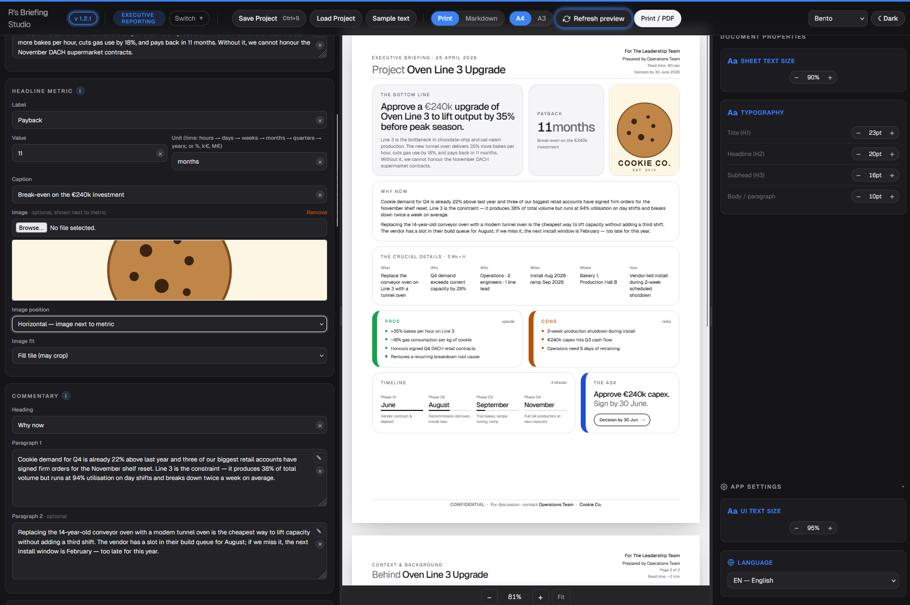

# R's Briefing Studio



A small static web app that turns proposals into beautifully designed, two-page briefings — one for executive readers, one for engineering reviewers. The output is built to be **read in 90 seconds (page 1)** with **full context available on demand (page 2)**.

Runs from plain HTML files — no server, no installer, no tracking. Tailwind, Alpine.js, and the Geist font load from public CDNs on first visit; after that the browser cache makes the app work offline. If you need a *truly* offline build (e.g. for an air-gapped environment), see [Going fully offline](#going-fully-offline) below.

> One page. One decision. Ninety seconds.

---

## What's new — v1.2.1

A polish-and-comfort release.

**Pop-out editor for multi-line fields.** Every textarea (headlines, supporting copy, page-2 prose) now has a small **pencil button** in its top-right. Click to open a fullscreen overlay with a much larger writing area — easier on long-form content than fighting a 3-row textarea. **Esc** cancels, **Ctrl + Enter** (⌘+Enter on Mac) saves, click outside to cancel. Fully translated.

**Tighter, calmer form pane.** More vertical breathing room (sections sit further apart, more padding inside each, fields spaced). The redundant box around timeline phases (exec) and around changes / cost-value / trade-offs / risks rows (eng) is replaced with a soft left-accent in the mode color — same grouping signal, no boxy frame.

**Other polish.**
- **Footers simplified** in the Executive briefing — duplicated "Prepared by / for / company / date" info removed (it's already in the header). Single low-profile line: Confidential badge + *For discussion · contact*.
- **Engineering bento compaction** — section padding, gaps, list spacing, and stack heights all tightened so the page feels less crowded; the bento baseline type scale is now **0.729×** of the original (≈81% of v1.2.0's 0.9×).
- **Refresh-preview button** now actually pulses — the previous keyframe was too faint; it's been redone with the same accent ring + glow + slight scale used by the version badge.
- Mode pill renamed **"Executive Reporting"** (was "Executive Level Reporting") and both pills now wrap consistently into two stacked rows.
- Default engineering image height is now **75 mm** (was 95 mm).

**Compatibility.** Existing project `.json` files load unchanged. UI preferences stay browser-local.

---

## What's shipped — v1.2.0

A focused release on **layout control, formatting, and chrome IA**. Highlights:

**Reorganized chrome (top bar).** A 3-column layout: identity (logo, version badge, mode pill, switch) on the left, **document-tied actions centered** directly above the document preview (project I/O, output config, Refresh, Print / PDF), and app preferences (Template, Dark / Light) on the right. Hover the mode pill to see exactly what each mode (Executive / Engineering) is built for, in all four UI languages. Visual dividers separate logical groups.

**Document properties (right tools pane).** A new resizable right-side toolbox:

- **Sheet text size** — global ± slider that scales every text element on the printed sheet.
- **Typography** — per-level pt control for Title (H1), Headline (H2), Subhead (H3), Body / paragraph in 1pt steps. Defaults: 22 / 20 / 16 / 10pt.
- The toolbox itself is **draggable** — grab its inner edge to resize.

**App settings (collapsible, anchored at the bottom).** Cog-iconed, open-by-default group inside the same tools pane. Holds **UI Text size** (form-pane density) and the **Language** picker (moved here from the chrome — it's a per-user preference, not a per-document one).

**Output controls.** Centered above the document: Print / Markdown · A4 / A3 (**A4 is the new default**) · **Refresh preview** (icon + label, gentle resting pulse) · Print / PDF.

**Vertical-mode image with adjustable height.** When the headline image is placed *below* the metric/proposal/effort tile (vertical orientation), it now renders as a full-width tile with a per-document height slider (40–160 mm, 5 mm steps). Horizontal orientation is unchanged.

**Pulsing version badge.** Click any time to open the in-app release notes, which render `README.md` (with an inline fallback for `file://`).

**Polish.**
- About modal reframed as a permanent **Mission** statement (no version-specific notes any more — those now live on the badge). The modal is also scrollable on small screens.
- Template name simplified to **"Bento"** in both apps.
- Default audience / author set to neutral **"Operations Team"** / **"The Leadership Team"** (this is the empty-project default; *Sample text* still loads the placeholder cookie-factory case study).
- Dark / Light editor toggle now updates instantly when the language changes (was lagging by one click).
- In Markdown export mode the *Image position* and *Image fit* dropdowns are disabled (they're PDF-layout only) with an inline note explaining why.

**Compatibility.** Existing project `.json` files load unchanged. UI preferences (text sizes, paper size, theme, pane widths, language) stay browser-local and don't travel with the project file.

---

## What's shipped — v1.1.0

**Markdown export mode.** Both editors ship with a *Print / Markdown* toggle in the chrome.

- **Print mode** — the right pane shows the two A4/A3 pages and the primary button prints to PDF.
- **Markdown mode** — the right pane swaps to a rendered wiki-style preview, and the primary button becomes **Export .md**.

The exported `.md` file is wiki-flavoured Markdown built around the standard macro set most company wikis support:

- **Info / note / warning panels** for the bottom line, the ask, and high-severity risks
- **Expand / collapse** wraps the page-2 context section
- **Table of contents** macro at the top
- **Inline status badges** for confidentiality, decision deadlines, evidence (M / E / G), risk severity, cost-vs-value
- **Tables** for every two-column layout — pros vs. cons, metric vs. visual, cost & value, trade-offs, dependencies, alternatives, stakeholders, timeline (with `[████░░░░░░] 40%` ASCII progress bars)
- **Task-list checkboxes** for engineering open questions

Markdown mode also offers a *Strip embedded images* toggle for when base64 image data would exceed your wiki's paste limits, and a *Copy* button alongside *Export .md*.

---

## Why this exists

**This app is not here to add another document to your pile.** It is the opposite of that. The point is to *replace* sprawling Word docs and forty-slide decks with one clear, two-page packet of digestible chunks — a shared canvas you and your teammates can sync on quickly, without ambiguity.

Modern work happens in parallel. The people whose decisions unblock you are reading at the bottom of a stack of twelve other proposals, three of which are about to slip, and one of which someone wants to talk about *right now*. They do not have time to read your nine-page Word document. They do not want to sit through your forty-slide deck. They will skim, decide, and move on — whether you want them to or not.

The app gives you a **formalized format**: an idea, an issue, or an opportunity broken into the smallest set of fields that still preserves the decision. Each field is a digestible chunk. Each chunk has a clear discipline behind it. Once you've filled it in, the briefing is something you, your manager, your peers, and your reviewers can all look at *together* and arrive at the same picture in 90 seconds. That is what "syncing with teammates" actually means in practice — not more meetings, but a shared, low-ambiguity artefact that the meeting can be about.

This app is a forcing function for the writer. It makes you commit to:

- **The decision you actually want.** Not a discussion, not a status update — an *ask*, with a deadline.
- **The headline number.** One metric, the one that, if it's wrong, the whole proposal is wrong.
- **The trade-offs.** Pros, cons, alternatives — the things the reader would push back on.
- **What you actually know vs. what you're guessing.** Engineering briefings tag every number `M` (measured), `E` (estimated) or `G` (gut). Reviewers calibrate accordingly.

The output is a **self-contained information packet** that respects the reader's time. It works as a kick-starter for a deeper conversation: by the time you walk into the room, you and the reader share the same picture of the decision, the data, the risks, and the path. The discussion is then about substance — not about catching the reader up.

The goal is to drive the chance of misunderstanding and wrong assumptions as close to zero as the format allows.

## If text overflows the page, that's a feature

When your content spills past the page boundaries, the app does **not** truncate it, scale it down, or quietly hide it — it lets it overflow, on purpose. The two-page limit is the discipline. The overflow is the app telling you: *this idea is not yet tight enough to fit*.

Tighten the wording. Drop the adjective. Cut the example. Pick the one number that matters and lose the rest. The format is the forcing function — keep editing until everything fits, and you will end up with a sharper briefing than if the app had silently shrunk your text to make room.

## What you formalize

When you fill in a briefing you are forced — by the structure of the form — to commit to:

| Section | What it forces you to formalize |
|---|---|
| Bottom line / Proposal | The single sentence that contains the decision and its headline number |
| Headline metric | The one number that captures the "so what" |
| 5 Ws + H *(executive)* | What, Why, Who, When, Where, How — facts in one short clause each |
| What changes *(engineering)* | Before / after pairs the reader can verify |
| Cost & value *(engineering)* | Numbers if possible, with evidence tags (M/E/G) |
| Pros / Cons | 2–4 ranked items, outcomes the reader can verify |
| Trade-offs | Paths actually considered, with the chosen one marked |
| Risks | Real risks the reader would raise — not strawmen |
| Open questions | Things you genuinely need answered before committing |
| The ask / CTA | One decision, one deadline, named reviewers |
| Page 2 — context | Background, problem, stakeholders, considerations, alternatives, risks, supporting data |

Every section has an info button (the pulsing `i` icon) that explains the *discipline* behind that field. The hints are deliberately written to push toward concise, decision-focused communication.

## Two report types

The app ships with two distinct briefing flavors. Pick the one that matches your audience:

| App | File | For | Accent |
|---|---|---|---|
| **Executive Level Reporting** | `app-exec.html` | Decision-makers, leadership | Blue |
| **Engineering Reporting** | `app-eng.html` | Technical reviewers, eng leads, PM, SRE | Green |

The chrome of each app shows the mode in a colored pill at the top so you always know which kind of briefing you are writing.

---

## Getting started

**To run it: download this repo and double-click `index.html`.** That's it.

**Requirements:**
- A relatively modern desktop browser on your PC — Chrome, Edge, Firefox, or Safari from the last ~3 years.
- Nothing else. No installer, no Node.js, no Python, no server. Everything runs locally in the browser.
- An internet connection is required on first visit so the browser can fetch Tailwind, Alpine.js and the Geist font from their CDNs. After that the browser cache keeps the app working offline. To eliminate the CDN dependency entirely, see [Going fully offline](#going-fully-offline).

**Step by step:**

1. Download or clone this repository (`git clone …`, or click *Code → Download ZIP* and unzip).
2. Open the folder, double-click `index.html` — your browser opens it.
3. Pick **New Executive Level Report** or **New Engineering Report**, or load an existing project file.

The app saves automatically to your browser's `localStorage`. To share a project with someone else, click **Save Project** to download a `.json` file (the uploaded image is embedded as base64, so the file is self-contained). The recipient opens `index.html`, clicks **Open existing project**, and the app routes them to the correct editor automatically.

### Print to PDF

Click **Print / PDF** in the chrome. The app strips the form pane and renders both pages on one print stream. Page size follows the `A4` / `A3` toggle in the chrome.

For best PDF fidelity:
- Choose **Save as PDF** in the print dialog.
- Under *More settings*, enable **Background graphics** (so the colored tile accents render).
- Margins: **None** (the layout already includes its own margins).

### Export to Markdown (wiki-flavoured)

Switch the **Print / Markdown** toggle in the chrome to *Markdown*. The right pane swaps to a rendered preview that shows panels, expand blocks, status badges, tables, and the table of contents the way a wiki would render them. Click **Export .md** to download the file, or **Copy** to put the markdown on your clipboard.

The output uses fenced macro blocks (e.g. ` ```panel:info `, ` ```expand `, ` ```toc `) plus inline `!status:color:text!` tokens. Most major company wikis recognise these macros; on viewers that don't, the content still renders as standard Markdown inside a code fence — nothing is lost, it just falls back to plain.

If your wiki rejects long base64 image data on paste, tick **Strip embedded images** before exporting and re-upload the image manually after the page is created.

### What's in localStorage

Per-app settings (template, dark/light editor mode, paper size, UI scale, splitter width, last edited project) live in `localStorage` keys prefixed `briefing-…` (executive) and `eng-briefing-…` (engineering). They are per-browser, per-device — they never leave your machine.

---

## How to modify the project

The codebase is intentionally small and unbundled:

```
Rs_Briefing-Studio/
├── index.html                  # Landing page (new project / open existing)
├── app-exec.html               # Executive Level Reporting editor
├── app-eng.html                # Engineering Reporting editor
├── i18n.xml                    # Translation table (EN / DE / IT / HR)
├── i18n.js                     # Translation loader (parses i18n.xml at runtime)
├── product-spec.md             # Living technical spec (data model, layouts, design system)
├── README.md                   # This file
├── LICENSE                     # MIT
├── doc/
│   └── imgs/                   # Screenshots used by README.md
└── Example Briefings/          # Reference PDFs of finished output
    ├── ExampleExecutiveBriefing.pdf
    └── ExampleEngineeringBriefing.pdf
```

No build step. No npm install. No node_modules. Dependencies:

**External (CDN-loaded):**
- [**Tailwind CSS**](https://cdn.tailwindcss.com) — utility CSS framework
- [**Alpine.js** v3.13.5](https://alpinejs.dev) — small reactivity layer driving form ⇄ preview binding (loaded only by the editor apps, not by `index.html`)
- [**Geist** font](https://fonts.googleapis.com/css2?family=Geist) — single typeface for the whole UI, weights 400/500/600/700

**Local (shipped with the repo):**
- `i18n.js` — translation loader, ~15 lines of glue code that parses `i18n.xml` (or its inline fallback) and applies translations to elements via `data-i18n`, `data-i18n-html`, `data-i18n-placeholder`, and `data-i18n-title` attributes
- `i18n.xml` — translation source for English, German, Italian, Croatian

**Browser built-ins used (no dependency):** `DOMParser` (XML parsing), `FileReader` (image upload, project file load), `localStorage` / `sessionStorage` (persistence + handoff), `MutationObserver` (auto-injecting clear-buttons on dynamically added inputs).

To make a change, open the relevant `.html` file in your editor, edit, save, refresh the browser. That's it.

### Where to make common changes

| Goal | File / location |
|---|---|
| Change the form / preview content of executive briefings | `app-exec.html` |
| Change the form / preview content of engineering briefings | `app-eng.html` |
| Change the landing page or About modal | `index.html` |
| Change the data model | `sampleData()` at the bottom of each app file *and* the corresponding form fields *and* the preview tiles. The editor will warn you in the console if you forget a piece. |
| Tune the design system (colors, spacing, typography) | The `<style>` block at the top of each HTML file. Mode accent colors are the `--mode-accent` / `--mode-accent-soft` CSS custom properties at the top of `:root`. |
| Add a new tile to page 1 | Add it to the bento grid in the preview section, give it a `grid-column: span N` rule in CSS (12 columns total per row). Update the bento auto-flow rules if it should sit on its own row. |
| Add a new field to page 2 | Add it under the corresponding `data.context` key in the data model and `sampleData()`, add a form input in the *Page 2 — Context* section, and render it inside the editorial column. |
| Add a new info-button term hint | Reuse the `<span class="hint" x-data="{ open: false }">` pattern used on every section heading. The `.term-hint` modifier exists for subtler inline hints next to field labels. |

For a complete reference of the data model, design tokens, component layout, and architecture choices, see [`product-spec.md`](./product-spec.md).

---

## Languages (i18n)

> **Work in progress — translations may be buggy.** The English copy is the canonical source of truth. The DE / IT / HR translations are a first machine-assisted pass and will benefit from a native-speaker review. If you spot a translation that reads awkwardly or is plain wrong, edit `i18n.xml` directly (and mirror the same edit in `i18n.js → FALLBACK_XML` so offline `file://` users see the fix).

The UI ships with four languages: **English (EN)**, **Deutsch (DE)**, **Italiano (IT)**, **Hrvatski (HR)**. Switch in the top-right of the chrome — the choice persists per browser. Every translatable label, button, section heading, switch-menu item, and modal title is driven by the same translation table.

The translation source is `i18n.xml` at the project root. Each entry looks like:

```xml
<string key="ui.saveproject">
  <en>Save Project</en>
  <de>Projekt speichern</de>
  <it>Salva progetto</it>
  <hr>Spremi projekt</hr>
</string>
```

**To translate an existing string:** open `i18n.xml`, find the `<string key="…">` and edit the language tag.

**To add a new language:** add a new tag (e.g. `<fr>…</fr>`) inside every `<string>`, then extend `i18n.js` → `LANGUAGES`, `LANG_NAMES`, `LANG_FLAGS` and add an `<option>` to each chrome's language `<select>`.

**To add a new UI string:** add a `<string key="some.unique.key">` block in `i18n.xml`, then mark the matching HTML element with `data-i18n="some.unique.key"`. (Use `data-i18n-placeholder` for input placeholders, `data-i18n-title` for tooltip text.)

**Note on offline use:** when you open the HTML files directly via `file://`, Chrome blocks `fetch('i18n.xml')` for security reasons. `i18n.js` therefore ships with a synced inline copy of the XML as a fallback. If you change `i18n.xml` and want offline users to see the change, also update the `FALLBACK_XML` literal at the top of `i18n.js`. (Or serve the project over a local server like `python -m http.server` and the XML loads directly.)

## Confidentiality / NDA marking

Both editors have **Company name** and a **Confidential** checkbox in the *Meta* section.

- **Company name** appears in the prepared-by line of both page footers, between the audience and the date.
- **Confidential** (checked by default) renders a red bordered "CONFIDENTIAL" badge in the footer of both pages — useful for documents falling under NDA. Uncheck to remove.

Both fields are part of `data.meta` and round-trip through Save Project / Load Project.

## Privacy

- Everything runs in your browser. No analytics, no tracking, no telemetry.
- Project content lives only in your browser's `localStorage` and in `.json` files you explicitly save.
- The HTML source contains no real briefing data — only sample placeholder content (a cookie-factory case study).
- Sharing the source code with a colleague will *not* leak any project files: those live in `localStorage`, which is per-browser, and in `.json` files you choose where to save.

---

## Going fully offline

By default the app loads three things from public CDNs on first visit, then relies on the browser cache:

| Asset | Source | What it does | License |
|---|---|---|---|
| **Tailwind CSS (Play CDN)** | `https://cdn.tailwindcss.com` | Generates utility classes at runtime by scanning the HTML | MIT |
| **Alpine.js v3.13.5** | `https://cdn.jsdelivr.net/npm/alpinejs@3.13.5/dist/cdn.min.js` | Reactivity (`x-data`, `x-show`, `x-text`, …) | MIT |
| **Geist font (400/500/600/700)** | `https://fonts.googleapis.com/css2?family=Geist:wght@400;500;600;700` | Body & UI typeface | OFL-1.1 |

Once those have loaded once, the browser cache keeps the app working without internet. If you need to run on an **air-gapped machine** or guarantee no first-visit network access (e.g. shipping the project on a USB stick), follow these steps. **The repo intentionally does not ship these vendor files** so we don't have to manage their licenses on every release — each project below has its own license terms; please honour them in your distribution.

### 1. Download the three assets

Pick a `vendor/` folder at the project root and put files there:

```
vendor/
├── tailwind.min.js          # https://cdn.tailwindcss.com (save as)
├── alpine.min.js            # https://cdn.jsdelivr.net/npm/alpinejs@3.13.5/dist/cdn.min.js
└── fonts/
    ├── geist.css            # the @font-face stylesheet from fonts.googleapis.com (see step 3)
    └── geist-*.woff2        # the four .woff2 files referenced inside that CSS
```

### 2. Replace the CDN tags in each HTML file

Edit `index.html`, `app-exec.html`, and `app-eng.html` — change the four lines at the top of each `<head>` from CDN URLs to local relative paths:

```diff
- <script src="https://cdn.tailwindcss.com"></script>
+ <script src="vendor/tailwind.min.js"></script>

- <script defer src="https://cdn.jsdelivr.net/npm/alpinejs@3.13.5/dist/cdn.min.js"></script>
+ <script defer src="vendor/alpine.min.js"></script>

- <link rel="preconnect" href="https://fonts.googleapis.com" />
- <link rel="preconnect" href="https://fonts.gstatic.com" crossorigin />
- <link href="https://fonts.googleapis.com/css2?family=Geist:wght@400;500;600;700&display=swap" rel="stylesheet" />
+ <link href="vendor/fonts/geist.css" rel="stylesheet" />
```

(`index.html` doesn't load Alpine — only the `app-*.html` files do.)

### 3. Bundle the Geist webfont locally

The Google Fonts URL returns a stylesheet that points to remote `.woff2` files. To self-host:

1. Open `https://fonts.googleapis.com/css2?family=Geist:wght@400;500;600;700&display=swap` in a browser, copy the CSS, and save as `vendor/fonts/geist.css`.
2. That CSS contains four `src: url(https://fonts.gstatic.com/...woff2)` references. Download each `.woff2` into `vendor/fonts/` and rewrite the URLs in `geist.css` to relative paths (e.g. `url("./geist-400.woff2")`).
3. Done — the font now loads from disk.

### 4. (Optional) Pre-build Tailwind instead of using the runtime

The Play CDN script is convenient but ~400KB and JIT-runs on every page load. For long-term offline use you can swap it for a pre-built static stylesheet using the Tailwind CLI:

```bash
npx tailwindcss -i ./input.css -o ./vendor/tailwind.css --minify
# (one-time build — needs Node.js once, then no Node at runtime)
```

…then change the script tag to `<link rel="stylesheet" href="vendor/tailwind.css">`. This is heavier upfront but produces a much smaller, deterministic CSS bundle.

After step 2 the app works on a freshly-imaged, fully-offline machine. Don't forget to include the licenses for Tailwind (MIT), Alpine.js (MIT), and Geist (OFL-1.1) in your `vendor/` folder if you redistribute.

---

## License

Released under the [MIT License](./LICENSE) — do whatever you want with it, no warranty.

---

## Author

**Rene Radojčić** · [rene.radojcic@hotmail.com](mailto:rene.radojcic@hotmail.com)

Built end-to-end with HTML, Tailwind CSS, and Alpine.js. No server. No tracking. CDN-bootstrapped, then works offline once cached — or fully offline if you vendor the dependencies (see below).
